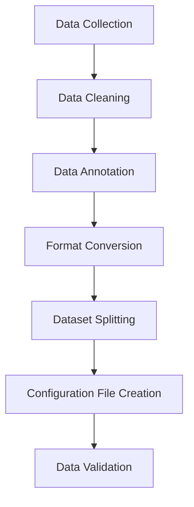

# YOLO Dataset Preparation Guide

This guide details how to prepare datasets for YOLO training, including data collection, annotation, format conversion, and validation.

## Dataset Preparation Workflow



## 1. Data Collection Strategy

### 1.1 Data Sources

| Source | Advantages | Disadvantages | Use Cases |
|--------|------------|---------------|-----------|
| **Public Datasets** | Free, high-quality annotations, variety | May not match target scenarios | Pretraining, benchmarking |
| **Web Scraping** | Large volume, diverse scenarios | Missing annotations, copyright issues | Data augmentation |
| **Manual Collection** | High scenario relevance, quality control | High cost, time-consuming | Professional applications |
| **Synthetic Data** | Unlimited data, perfect annotations | May differ from real data | Supplementary training |

### 1.2 Data Collection Principles

1. **Diversity**: Cover different lighting, angles, scales, backgrounds
2. **Representativeness**: Accurately reflect actual application scenarios
3. **Balance**: Relatively balanced number of categories
4. **High Quality**: Clear images, no blur, no occlusion

### 1.3 Recommended Public Datasets

| Dataset | Task | Classes | Images | Link |
|---------|------|---------|--------|------|
| **COCO** | Detection/Segmentation | 80 | 330K | [cocodataset.org](https://cocodataset.org) |
| **VOC** | Detection/Segmentation | 20 | 11.5K | [host.robots.ox.ac.uk](http://host.robots.ox.ac.uk/pascal/VOC/) |
| **Open Images** | Detection | 600 | 1.9M | [storage.googleapis.com](https://storage.googleapis.com/openimages/web/index.html) |
| **ImageNet** | Classification | 1000 | 1.4M | [image-net.org](https://www.image-net.org) |
| **MPII** | Pose Estimation | - | 25K | [human-pose.mpi-inf.mpg.de](http://human-pose.mpi-inf.mpg.de) |
| **Cityscapes** | Segmentation | 30 | 25K | [cityscapes-dataset.com](https://www.cityscapes-dataset.com) |

## 2. Data Annotation

### 2.1 Annotation Tool Selection

| Tool | Type | Advantages | Disadvantages | Supported Formats |
|------|------|------------|---------------|-------------------|
| **LabelImg** | Desktop app | Simple, supports YOLO format | Basic features | YOLO, PascalVOC |
| **CVAT** | Web app | Powerful, collaboration friendly | Requires deployment | COCO, YOLO, VOC, etc. |
| **Roboflow** | Cloud service | All-in-one solution | Paid versions expensive | All major formats |
| **Label Studio** | Open-source platform | Flexible, extensible | Complex configuration | Custom formats |
| **Makesense.ai** | Online tool | Free, no installation | Requires internet | YOLO, COCO, etc. |
| **VGG Image Annotator** | Online tool | Simple, direct | Limited features | CSV, JSON |

### 2.2 Annotation Best Practices

#### **Bounding Box Annotation**
- Tightly surround targets, but not too tight
- Include complete targets, avoid truncation
- For occluded targets, annotate visible parts
- Keep bounding boxes horizontal (unless using OBB task)

#### **Class Annotation**
- Use consistent class names
- Establish clear class hierarchy
- Annotate all visible targets, avoid omissions
- For difficult samples, use "difficult" flag

#### **Segmentation Annotation**
- Precisely annotate along target contours
- Use polygons for complex shapes
- Ensure segmentation masks are continuous without holes
- Correctly handle overlapping areas

### 2.3 LabelImg Usage Example

```bash
# Install LabelImg
pip install labelImg

# Start annotation tool
labelImg

# Or specify image directory
labelImg [image_directory] [predefined_classes_file]
```

Annotation workflow:
1. Open image directory
2. Set output directory (recommend `labels/`)
3. Select YOLO format
4. Create/load class file
5. Annotate targets and save

## 3. Data Format Conversion

### 3.1 YOLO Format Details

#### **Directory Structure**
```
my_dataset/
├── data.yaml            # Dataset configuration file
├── images/
│   ├── train/           # Training images
│   │   ├── img1.jpg
│   │   └── img2.jpg
│   └── val/             # Validation images
│       ├── img3.jpg
│       └── img4.jpg
└── labels/
    ├── train/           # Training labels
    │   ├── img1.txt
    │   └── img2.txt
    └── val/             # Validation labels
        ├── img3.txt
        └── img4.txt
```

#### **Label File Format**
Each label file corresponds to one image, one line per target:
```
<class_id> <x_center> <y_center> <width> <height>
```

Example `img1.txt`:
```
0 0.512 0.613 0.156 0.311
2 0.789 0.422 0.123 0.245
0 0.345 0.256 0.067 0.189
```

Coordinate calculation:
```python
x_center = (x_min + x_max) / 2 / image_width
y_center = (y_min + y_max) / 2 / image_height
width = (x_max - x_min) / image_width
height = (y_max - y_min) / image_height
```

### 3.2 Format Conversion Scripts

#### **COCO to YOLO**
```python
import json
from pathlib import Path

def coco_to_yolo(coco_json_path, output_dir):
    """Convert COCO format to YOLO format"""
    
    # Load COCO annotations
    with open(coco_json_path, 'r') as f:
        coco_data = json.load(f)
    
    # Create output directories
    images_dir = Path(output_dir) / 'images'
    labels_dir = Path(output_dir) / 'labels'
    images_dir.mkdir(parents=True, exist_ok=True)
    labels_dir.mkdir(parents=True, exist_ok=True)
    
    # Map category IDs to YOLO class indices
    categories = {cat['id']: idx for idx, cat in enumerate(coco_data['categories'])}
    
    # Process each image
    for img_info in coco_data['images']:
        img_id = img_info['id']
        img_width = img_info['width']
        img_height = img_info['height']
        img_name = img_info['file_name']
        
        # Find annotations for this image
        img_annotations = [ann for ann in coco_data['annotations'] if ann['image_id'] == img_id]
        
        # Create label file
        label_file = labels_dir / f"{Path(img_name).stem}.txt"
        with open(label_file, 'w') as f:
            for ann in img_annotations:
                # Get bounding box [x, y, width, height] in COCO format
                bbox = ann['bbox']
                x_min, y_min, width, height = bbox
                
                # Convert to YOLO format
                x_center = (x_min + width / 2) / img_width
                y_center = (y_min + height / 2) / img_height
                width_norm = width / img_width
                height_norm = height / img_height
                
                # Get class ID
                class_id = categories.get(ann['category_id'], 0)
                
                # Write to file
                f.write(f"{class_id} {x_center:.6f} {y_center:.6f} {width_norm:.6f} {height_norm:.6f}\n")
    
    print(f"Conversion complete. Output directory: {output_dir}")
```

#### **VOC to YOLO**
```python
import xml.etree.ElementTree as ET
from pathlib import Path

def voc_to_yolo(voc_xml_path, output_dir, class_mapping):
    """Convert VOC XML format to YOLO format"""
    
    # Parse XML
    tree = ET.parse(voc_xml_path)
    root = tree.getroot()
    
    # Get image dimensions
    size = root.find('size')
    img_width = int(size.find('width').text)
    img_height = int(size.find('height').text)
    
    # Create output file
    output_file = Path(output_dir) / f"{Path(voc_xml_path).stem}.txt"
    
    with open(output_file, 'w') as f:
        # Process each object
        for obj in root.findall('object'):
            # Get class name
            class_name = obj.find('name').text
            class_id = class_mapping.get(class_name, 0)
            
            # Get bounding box
            bndbox = obj.find('bndbox')
            x_min = float(bndbox.find('xmin').text)
            y_min = float(bndbox.find('ymin').text)
            x_max = float(bndbox.find('xmax').text)
            y_max = float(bndbox.find('ymax').text)
            
            # Convert to YOLO format
            x_center = (x_min + x_max) / 2 / img_width
            y_center = (y_min + y_max) / 2 / img_height
            width = (x_max - x_min) / img_width
            height = (y_max - y_min) / img_height
            
            # Write to file
            f.write(f"{class_id} {x_center:.6f} {y_center:.6f} {width:.6f} {height:.6f}\n")
```

## 4. Dataset Configuration

### 4.1 YAML Configuration File

Create `data.yaml` in your dataset directory:

```yaml
# Dataset configuration for YOLO training

# Paths (relative to this file or absolute)
path: /path/to/your/dataset  # dataset root directory
train: images/train  # training images (relative to 'path')
val: images/val      # validation images (relative to 'path')
test: images/test    # test images (optional, relative to 'path')

# Class information
names:
  0: person
  1: bicycle
  2: car
  3: motorcycle
  4: airplane
  5: bus
  6: train
  7: truck
  8: boat
  9: traffic light
  # ... add all your classes

# Optional parameters
nc: 80               # number of classes
roboflow:
  workspace: your-workspace
  project: your-project
  version: 1
  license: CC BY 4.0
  url: https://universe.roboflow.com/...
```

### 4.2 Dataset Splitting

```python
from sklearn.model_selection import train_test_split
import shutil
from pathlib import Path

def split_dataset(image_dir, label_dir, output_dir, train_ratio=0.7, val_ratio=0.2, test_ratio=0.1):
    """Split dataset into train/val/test sets"""
    
    # Get all image files
    image_files = list(Path(image_dir).glob('*.jpg')) + list(Path(image_dir).glob('*.png'))
    
    # Split indices
    train_files, temp_files = train_test_split(image_files, train_size=train_ratio, random_state=42)
    val_files, test_files = train_test_split(temp_files, train_size=val_ratio/(val_ratio+test_ratio), random_state=42)
    
    # Create output directories
    splits = {
        'train': train_files,
        'val': val_files,
        'test': test_files
    }
    
    for split_name, files in splits.items():
        # Create directories
        img_split_dir = Path(output_dir) / 'images' / split_name
        label_split_dir = Path(output_dir) / 'labels' / split_name
        img_split_dir.mkdir(parents=True, exist_ok=True)
        label_split_dir.mkdir(parents=True, exist_ok=True)
        
        # Copy files
        for img_file in files:
            # Copy image
            shutil.copy(img_file, img_split_dir / img_file.name)
            
            # Copy corresponding label
            label_file = Path(label_dir) / f"{img_file.stem}.txt"
            if label_file.exists():
                shutil.copy(label_file, label_split_dir / label_file.name)
    
    print(f"Dataset split complete: {len(train_files)} train, {len(val_files)} val, {len(test_files)} test")
```

## 5. Data Augmentation

### 5.1 Built-in YOLO Augmentation

YOLO provides built-in augmentation during training. Configure in training command:

```python
from ultralytics import YOLO

model = YOLO('yolo26n.pt')

# Training with augmentation
model.train(
    data='dataset.yaml',
    epochs=100,
    imgsz=640,
    # Augmentation parameters
    hsv_h=0.015,  # HSV-Hue augmentation (fraction)
    hsv_s=0.7,    # HSV-Saturation augmentation (fraction)
    hsv_v=0.4,    # HSV-Value augmentation (fraction)
    degrees=0.0,  # Image rotation (+/- deg)
    translate=0.1,  # Image translation (+/- fraction)
    scale=0.5,    # Image scale (+/- gain)
    shear=0.0,    # Image shear (+/- deg)
    perspective=0.0,  # Image perspective (+/- fraction)
    flipud=0.0,   # Image flip up-down (probability)
    fliplr=0.5,   # Image flip left-right (probability)
    mosaic=1.0,   # Image mosaic (probability)
    mixup=0.0,    # Image mixup (probability)
    copy_paste=0.0,  # Segment copy-paste (probability)
)
```

### 5.2 Custom Augmentation Pipeline

```python
import albumentations as A
from albumentations.pytorch import ToTensorV2

def get_augmentations(mode='train'):
    """Get augmentation pipeline for training or validation"""
    
    if mode == 'train':
        return A.Compose([
            A.Resize(640, 640),
            A.HorizontalFlip(p=0.5),
            A.VerticalFlip(p=0.1),
            A.RandomBrightnessContrast(p=0.2),
            A.RandomGamma(p=0.2),
            A.HueSaturationValue(p=0.3),
            A.Rotate(limit=15, p=0.5),
            A.Blur(blur_limit=3, p=0.1),
            A.CLAHE(p=0.1),
            A.ToGray(p=0.1),
            ToTensorV2()
        ], bbox_params=A.BboxParams(format='yolo', label_fields=['class_labels']))
    
    else:  # validation/test
        return A.Compose([
            A.Resize(640, 640),
            ToTensorV2()
        ], bbox_params=A.BboxParams(format='yolo', label_fields=['class_labels']))
```

## 6. Data Validation

### 6.1 Dataset Statistics

```python
from collections import Counter
from pathlib import Path
import matplotlib.pyplot as plt

def analyze_dataset(labels_dir):
    """Analyze dataset statistics"""
    
    label_files = list(Path(labels_dir).glob('*.txt'))
    
    # Count objects per class
    class_counts = Counter()
    bbox_stats = {'widths': [], 'heights': []}
    
    for label_file in label_files:
        with open(label_file, 'r') as f:
            for line in f:
                parts = line.strip().split()
                if len(parts) >= 5:
                    class_id = int(parts[0])
                    class_counts[class_id] += 1
                    
                    # Bbox dimensions
                    width = float(parts[3])
                    height = float(parts[4])
                    bbox_stats['widths'].append(width)
                    bbox_stats['heights'].append(height)
    
    # Print statistics
    print(f"Total label files: {len(label_files)}")
    print(f"Total objects: {sum(class_counts.values())}")
    print("\nClass distribution:")
    for class_id, count in sorted(class_counts.items()):
        print(f"  Class {class_id}: {count} objects ({count/sum(class_counts.values())*100:.1f}%)")
    
    # Plot distribution
    plt.figure(figsize=(10, 5))
    plt.subplot(1, 2, 1)
    plt.hist(bbox_stats['widths'], bins=50, alpha=0.7)
    plt.title('Bounding Box Width Distribution')
    plt.xlabel('Normalized Width')
    
    plt.subplot(1, 2, 2)
    plt.hist(bbox_stats['heights'], bins=50, alpha=0.7)
    plt.title('Bounding Box Height Distribution')
    plt.xlabel('Normalized Height')
    
    plt.tight_layout()
    plt.show()
```

### 6.2 Common Issues and Fixes

| Issue | Symptoms | Solution |
|-------|----------|----------|
| **Class Imbalance** | Poor performance on rare classes | Data augmentation, class weighting, oversampling |
| **Incorrect Annotations** | High training loss, poor validation | Manual review, automated validation scripts |
| **Format Errors** | Training fails to start | Verify YOLO format, check coordinate ranges |
| **Missing Labels** | Objects not detected | Ensure all objects are annotated |
| **Inconsistent Naming** | Class mapping errors | Standardize class names in data.yaml |

## 7. Quality Assurance Checklist

- [ ] All images are properly formatted (JPEG, PNG)
- [ ] Image dimensions are consistent or properly resized
- [ ] All objects of interest are annotated
- [ ] Bounding boxes are tight and accurate
- [ ] Class labels are consistent across dataset
- [ ] Dataset is properly split (train/val/test)
- [ ] data.yaml file is correctly configured
- [ ] Class distribution is balanced or addressed
- [ ] No duplicate images in different splits
- [ ] Dataset statistics have been analyzed

## 8. Next Steps

After dataset preparation:
1. **Verify** with `analyze_dataset()` function
2. **Test** with a small training run
3. **Optimize** augmentation parameters
4. **Document** dataset characteristics
5. **Backup** the prepared dataset

## Related Documentation

- [Training Basics](./training_basics.md) - Guide to training YOLO models
- [Model Selection](./model_selection.md) - Choosing appropriate models
- [Ultralytics Datasets Guide](https://docs.ultralytics.com/datasets/) - Official dataset documentation
- [Roboflow](https://roboflow.com) - Platform for dataset management and augmentation

## Utility Scripts

For ready-to-use dataset preparation tools, use the `dataset_tools.py` script:

```bash
# Run dataset tools examples
python scripts/dataset_tools.py

# Import in your code
from scripts.dataset_tools import (
    coco_to_yolo,          # Convert COCO to YOLO format
    voc_to_yolo,           # Convert VOC to YOLO format
    split_dataset,         # Split dataset into train/val/test
    analyze_dataset,       # Analyze dataset statistics
    create_data_yaml,      # Create dataset configuration
    validate_dataset,      # Validate dataset structure
    get_augmentation_pipeline  # Get augmentation pipeline
)

# Example usage
coco_to_yolo('annotations.json', 'yolo_dataset')
stats = analyze_dataset('dataset/labels/train')
config_path = create_data_yaml('dataset', ['person', 'car', 'bicycle'])
```

**Script Location**: `scripts/dataset_tools.py`

**Benefits**:
- Save tokens by extracting large code blocks from documentation
- Ready-to-use functions, no need to copy-paste
- Modular design, import only what you need
- Consistent error handling and logging