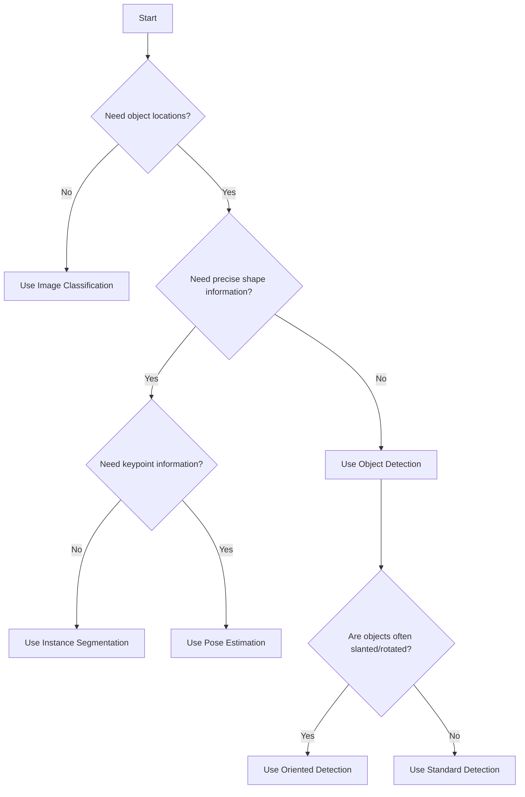

# YOLO Task Types Explained

Ultralytics YOLO supports multiple computer vision tasks, each suitable for different applications. This document provides detailed explanations of each task type and its use cases.

**Supported Tasks**: YOLO26 and YOLO11 support all five tasks: object detection, instance segmentation, image classification, pose estimation, and oriented bounding box detection.

## Task Overview

| Task Type | Output Description | Use Cases | Model Example | Complexity |
|-----------|-------------------|-----------|---------------|------------|
| **Object Detection** | Bounding boxes + class labels + confidence | General object recognition | yolo26n.pt | ★★☆☆☆ |
| **Instance Segmentation** | Pixel-level masks + class labels | Precise shape analysis | yolo26n-seg.pt | ★★★☆☆ |
| **Image Classification** | Image category + confidence | Whole scene classification | yolo26n-cls.pt | ★☆☆☆☆ |
| **Pose Estimation** | Keypoint coordinates + confidence | Human/object pose analysis | yolo26n-pose.pt | ★★★★☆ |
| **Oriented Detection** | Rotated bounding boxes + class labels | Slanted object detection | yolo26n-obb.pt | ★★★☆☆ |

## 1. Object Detection

### Overview
Object detection is the most fundamental and commonly used computer vision task, identifying object locations (bounding boxes) and categories in images.

### Output Format
- **Bounding Boxes**: [x_center, y_center, width, height] or [x1, y1, x2, y2] format
- **Class Labels**: COCO dataset includes 80 classes (person, car, animal, etc.)
- **Confidence Scores**: Prediction confidence between 0-1

### Use Cases
- Security surveillance: Person/vehicle detection
- Autonomous driving: Traffic sign, pedestrian detection  
- Industrial quality control: Defect product detection
- Retail analytics: Shelf product detection

### Code Examples

```python
from ultralytics import YOLO

# Load detection model
model = YOLO('yolo26n.pt')  # or yolo26s.pt, yolo26m.pt, etc.

# Detect objects in image
results = model('bus.jpg')
boxes = results[0].boxes  # Boxes object
print(f"Detected {len(boxes)} objects")

# Display results
for box in boxes:
    print(f"Class: {model.names[int(box.cls)]}, Confidence: {box.conf.item():.2f}")
    print(f"Location: {box.xywh[0].tolist()}")
```

**CLI Command:**
```bash
yolo detect predict model=yolo26n.pt source='bus.jpg'
```

## 2. Instance Segmentation

### Overview
Instance segmentation extends object detection by providing pixel-level masks for each object, enabling precise separation of overlapping objects.

### Output Format
- **Bounding Boxes**: Same as object detection
- **Class Labels**: Same as object detection
- **Segmentation Masks**: Binary mask matrices marking object pixels
- **Polygon Contours**: Contour points of masks

### Use Cases
- Medical imaging: Cell segmentation, organ segmentation
- Autonomous driving: Drivable area segmentation
- Remote sensing: Building outline extraction
- Robotics: Precise object contours for grasping

### Code Examples

```python
from ultralytics import YOLO

# Load segmentation model
model = YOLO('yolo26n-seg.pt')

# Segment image
results = model('street.jpg')

# Access segmentation results
masks = results[0].masks  # Masks object
if masks is not None:
    print(f"Segmented {len(masks)} instances")
    
    # Get mask for first object
    mask = masks[0].data.cpu().numpy()
    contours = masks[0].xy  # Contour points list
```

**CLI Command:**
```bash
yolo segment predict model=yolo26n-seg.pt source='street.jpg'
```

## 3. Image Classification

### Overview
Image classification categorizes entire images into predefined classes without providing object locations.

### Output Format
- **Top-k Classes**: Most likely k classes (default k=5)
- **Confidence Scores**: Prediction probabilities for each class
- **Feature Vectors**: Optional feature embeddings

### Use Cases
- Content moderation: NSFW/violent content identification
- Scene recognition: Indoor/outdoor, day/night
- Wildlife identification: Species classification
- Product categorization: Product type recognition

### Code Examples

```python
from ultralytics import YOLO

# Load classification model
model = YOLO('yolo26n-cls.pt')

# Classify image
results = model('cat.jpg')

# Access classification results
probs = results[0].probs  # Probs object
top5 = probs.top5  # Top 5 class indices
top5conf = probs.top5conf  # Top 5 confidence scores

print("Top 5 predictions:")
for idx, conf in zip(top5, top5conf):
    print(f"  {model.names[idx]}: {conf:.2%}")
```

**CLI Command:**
```bash
yolo classify predict model=yolo26n-cls.pt source='cat.jpg'
```

## 4. Pose Estimation

### Overview
Pose estimation detects object keypoints (e.g., human joints) for analyzing poses, movements, and behaviors.

### Output Format
- **Keypoint Coordinates**: [x, y, visibility] format
- **Skeleton Connections**: Relationships between keypoints
- **Confidence Scores**: Visibility scores for each keypoint

### Use Cases
- Sports analysis: Athlete movement evaluation
- Health monitoring: Elderly fall detection
- Interaction design: Gesture recognition
- Security: Abnormal behavior detection

### Code Examples

```python
from ultralytics import YOLO

# Load pose model
model = YOLO('yolo26n-pose.pt')

# Estimate pose
results = model('yoga.jpg')

# Access keypoints
keypoints = results[0].keypoints  # Keypoints object
if keypoints is not None:
    print(f"Detected poses for {len(keypoints)} people")
    
    # Get keypoints for first person
    kpts = keypoints[0].xy.cpu().numpy()
    confs = keypoints[0].conf.cpu().numpy()
    
    # Display keypoint coordinates
    for i, (x, y) in enumerate(kpts):
        print(f"Keypoint {i}: ({x:.1f}, {y:.1f}), Confidence: {confs[i]:.2f}")
```

**CLI Command:**
```bash
yolo pose predict model=yolo26n-pose.pt source='yoga.jpg'
```

## 5. Oriented Bounding Box Detection

### Overview
Oriented bounding box detection adds rotation angles to bounding boxes, making them more suitable for detecting slanted or rotated objects.

### Output Format
- **Rotated Bounding Boxes**: [x_center, y_center, width, height, angle]
- **Class Labels**: Same as object detection
- **Confidence Scores**: Prediction confidence

### Use Cases
- Remote sensing: Slanted buildings, vehicles
- Document analysis: Inclined text regions
- Industrial inspection: Rotated mechanical parts
- Autonomous driving: Angled parking spaces

### Code Examples

```python
from ultralytics import YOLO

# Load oriented detection model
model = YOLO('yolo26n-obb.pt')

# Detect oriented objects
results = model('aerial.jpg')

# Access oriented bounding boxes
obb = results[0].obb  # Oriented boxes object
if obb is not None:
    print(f"Detected {len(obb)} oriented objects")
    
    # Get parameters for first oriented box
    box = obb.xywhr[0]  # [x, y, w, h, angle]
    print(f"Center: ({box[0]:.1f}, {box[1]:.1f})")
    print(f"Size: {box[2]:.1f}×{box[3]:.1f}, Angle: {box[4]:.1f} rad")
```

**CLI Command:**
```bash
yolo obb predict model=yolo26n-obb.pt source='aerial.jpg'
```

## Task Selection Guide

### How to Choose Task Type?



### Performance Considerations

1. **Speed**: Classification > Detection > Segmentation ≈ Pose > Oriented Detection
2. **Accuracy Needs**: Balance speed vs. accuracy based on application
3. **Hardware Constraints**: Prefer smaller models for mobile, larger for servers
4. **Data Preparation**: Segmentation and pose tasks require more detailed annotations

### Multi-Task Combinations

In real applications, you can combine multiple tasks:

```python
# Detection followed by classification (two-stage processing)
det_model = YOLO('yolo26n.pt')
cls_model = YOLO('yolo26n-cls.pt')

# Detect objects
det_results = det_model('scene.jpg')

# Classify each detected object
for box in det_results[0].boxes:
    crop = box.xyxy  # Crop region
    # Perform fine-grained classification on crop
    cls_result = cls_model(crop)
```

## Model File Suffix Explanation

| Suffix | Task Type | Example Model |
|--------|-----------|---------------|
| `.pt` | Object Detection | yolo26n.pt |
| `-seg.pt` | Instance Segmentation | yolo26n-seg.pt |
| `-cls.pt` | Image Classification | yolo26n-cls.pt |
| `-pose.pt` | Pose Estimation | yolo26n-pose.pt |
| `-obb.pt` | Oriented Detection | yolo26n-obb.pt |

## YOLO Version Compatibility

- **YOLO26**: Supports all five tasks with latest optimizations
- **YOLO11**: Supports all five tasks, stable for production
- **YOLOv8**: Supports detection, segmentation, classification, pose
- **YOLOv5**: Primarily detection, limited other task support

## Advanced Topics

### Task-Specific Configuration

Each task has specific configuration parameters:
- **Detection**: `conf`, `iou`, `classes`, `agnostic_nms`
- **Segmentation**: `mask_ratio`, `retina_masks`
- **Classification**: `topk`, `temperature`
- **Pose**: `kpt_shape`, `skeleton`
- **OBB**: `angle_range`, `rotate`

See [Configuration Samples](./configuration_samples.md) for detailed examples.

### Custom Task Training

To train custom models for specific tasks:
1. Prepare task-specific dataset (COCO format for detection/segmentation, ImageNet format for classification, etc.)
2. Configure task-specific training parameters
3. Use appropriate model architecture

Detailed training guides: [Training Basics](./training_basics.md)

## Further Learning

- [Ultralytics Tasks Documentation](https://docs.ultralytics.com/tasks/)
- [COCO Dataset Classes](https://docs.ultralytics.com/datasets/detect/coco/)
- [Custom Task Training Guide](https://docs.ultralytics.com/guides/training/)
- [Model Selection Guide](./model_selection.md)
- [Configuration Examples](./configuration_samples.md)

## Utility Scripts for Task Testing

For quick testing of different YOLO tasks, use the `quick_tests.py` script:

```bash
# Test all tasks (requires model files)
python scripts/quick_tests.py --test all

# Test specific tasks
python scripts/quick_tests.py --test detection
python scripts/quick_tests.py --test segmentation --model yolo26n-seg.pt
python scripts/quick_tests.py --test classification --model yolo26n-cls.pt
python scripts/quick_tests.py --test pose --model yolo26n-pose.pt
python scripts/quick_tests.py --test obb --model yolo26n-obb.pt
```

**Script Location**: `scripts/quick_tests.py`

**Additional scripts for task-specific configurations**:
- `scripts/config_templates.py` - Task-specific configuration templates
- `scripts/model_utils.py` - Model selection for specific tasks
- `scripts/training_helpers.py` - Task-specific training configurations

**Benefits**:
- Save tokens by extracting code from documentation
- Quick testing of different YOLO tasks
- Consistent testing methodology
- Ready-to-use, no need to write test code