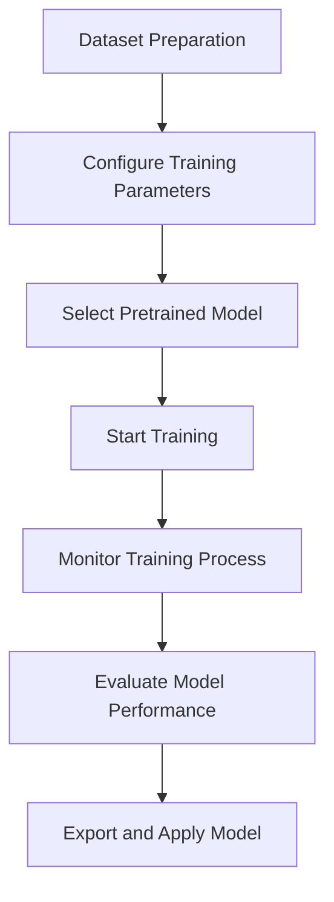

# YOLO Model Training Guide

This guide provides a complete workflow for training models using Ultralytics YOLO, covering dataset preparation, training configuration, execution monitoring, and result evaluation.

## Training Overview

YOLO training refers to the process of fine-tuning pretrained models or training new models from scratch using custom datasets. Ultralytics YOLO provides a simple yet powerful training interface supporting multiple vision tasks:

- **Object Detection** (detect): Train detection models
- **Instance Segmentation** (segment): Train segmentation models
- **Image Classification** (classify): Train classification models
- **Pose Estimation** (pose): Train pose estimation models
- **Oriented Bounding Box Detection** (obb): Train oriented detection models

## Training Workflow Overview

The complete training workflow includes the following steps:



## 1. Dataset Preparation

### 1.1 Dataset Formats

Ultralytics YOLO supports multiple dataset formats:

#### **YOLO Format (Recommended)**
```
dataset/
├── images/
│   ├── train/
│   │   ├── image1.jpg
│   │   └── image2.jpg
│   └── val/
│       ├── image3.jpg
│       └── image4.jpg
└── labels/
    ├── train/
    │   ├── image1.txt
    │   └── image2.txt
    └── val/
        ├── image3.txt
        └── image4.txt
```

Label file format (one line per object):
```
<class_id> <center_x> <center_y> <width> <height>
```
- Coordinates normalized to [0, 1] range
- `<class_id>` starts from 0

#### **COCO Format**
Supports COCO-style JSON annotation files with `images`, `annotations`, `categories` fields.

#### **Other Formats**
- **VOC**: Supports XML annotations
- **AutoDL**: Supports automatic dataset download

### 1.2 Data Configuration File (data.yaml)

Create a dataset configuration file `data.yaml` before training:

```yaml
# data.yaml example
path: /path/to/dataset  # Dataset root directory
train: images/train     # Training images path (relative to path)
val: images/val         # Validation images path (relative to path)
test: images/test       # Test images path (optional)

# Class definitions
names:
  0: person
  1: bicycle
  2: car
  3: motorcycle
  4: airplane
  5: bus
  6: train
  7: truck
  8: boat
  9: traffic light

# Number of classes
nc: 10

# Download link (optional, for automatic dataset download)
download: https://ultralytics.com/assets/coco8.zip
```

## 2. Training Configuration

### 2.1 Basic Training Parameters

```python
from ultralytics import YOLO

# Load a model
model = YOLO('yolo26n.pt')  # Pretrained model for fine-tuning
# or model = YOLO('yolo26n.yaml')  # Train from scratch

# Basic training configuration
model.train(
    data='dataset.yaml',    # Dataset configuration file
    epochs=100,             # Number of training epochs
    imgsz=640,              # Input image size
    batch=16,               # Batch size
    device='cuda:0',        # Training device
    workers=8,              # Data loading workers
    project='runs/train',   # Project directory
    name='exp1',            # Experiment name
    exist_ok=True,          # Overwrite existing directory
    resume=False,           # Resume from last checkpoint
)
```

### 2.2 Advanced Training Parameters

```python
# Advanced training configuration
model.train(
    data='dataset.yaml',
    epochs=100,
    imgsz=640,
    
    # Optimization parameters
    lr0=0.01,               # Initial learning rate
    lrf=0.01,               # Final learning rate factor
    momentum=0.937,         # SGD momentum
    weight_decay=0.0005,    # Optimizer weight decay
    warmup_epochs=3.0,      # Warmup epochs
    warmup_momentum=0.8,    # Warmup momentum
    warmup_bias_lr=0.1,     # Warmup bias learning rate
    
    # Augmentation parameters
    hsv_h=0.015,            # HSV-Hue augmentation
    hsv_s=0.7,              # HSV-Saturation augmentation
    hsv_v=0.4,              # HSV-Value augmentation
    degrees=0.0,            # Image rotation
    translate=0.1,          # Image translation
    scale=0.5,              # Image scaling
    shear=0.0,              # Image shearing
    perspective=0.0,        # Image perspective
    flipud=0.0,             # Flip up-down probability
    fliplr=0.5,             # Flip left-right probability
    mosaic=1.0,             # Mosaic augmentation probability
    mixup=0.0,              # Mixup augmentation probability
    copy_paste=0.0,         # Copy-paste augmentation probability
    
    # Model parameters
    pretrained=True,        # Use pretrained weights
    optimizer='auto',       # Optimizer: SGD, Adam, AdamW, etc.
    verbose=True,           # Verbose output
    seed=0,                 # Random seed
    deterministic=True,     # Deterministic training
    single_cls=False,       # Train as single-class dataset
    rect=False,             # Rectangular training
    cos_lr=False,           # Cosine learning rate scheduler
    label_smoothing=0.0,    # Label smoothing
    dropout=0.0,            # Dropout regularization
)
```

## 3. Model Selection for Training

### 3.1 Starting from Pretrained Models

```python
# Fine-tuning pretrained models (recommended for most cases)
model = YOLO('yolo26n.pt')      # Nano - fastest, smallest
model = YOLO('yolo26s.pt')      # Small - balanced
model = YOLO('yolo26m.pt')      # Medium - default for most applications
model = YOLO('yolo26l.pt')      # Large - higher accuracy
model = YOLO('yolo26x.pt')      # XLarge - maximum accuracy

# Task-specific models
model = YOLO('yolo26n-seg.pt')  # Segmentation
model = YOLO('yolo26n-cls.pt')  # Classification
model = YOLO('yolo26n-pose.pt') # Pose estimation
model = YOLO('yolo26n-obb.pt')  # Oriented detection
```

### 3.2 Training from Scratch

```python
# Train from scratch (requires large dataset)
model = YOLO('yolo26n.yaml')    # Architecture definition
model.train(
    data='dataset.yaml',
    epochs=300,                  # More epochs for from-scratch training
    pretrained=False,            # Don't use pretrained weights
    lr0=0.1,                     # Higher initial learning rate
)
```

## 4. Training Execution

### 4.1 Starting Training

```bash
# Python interface
python train.py

# CLI interface
yolo detect train data=dataset.yaml model=yolo26n.pt epochs=100 imgsz=640
```

### 4.2 Monitoring Training Progress

YOLO provides multiple ways to monitor training:

1. **Console Output**: Real-time metrics display
2. **TensorBoard**: `tensorboard --logdir runs/train`
3. **Weights & Biases**: Automatic integration when installed
4. **ClearML**: Automatic integration when installed
5. **MLflow**: Automatic integration when installed

### 4.3 Training Output Structure

```
runs/train/exp/
├── args.yaml                # Training arguments
├── results.csv              # Training metrics CSV
├── results.png              # Training metrics plot
├── confusion_matrix.png     # Confusion matrix
├── confusion_matrix_normalized.png
├── labels.jpg               # Training labels visualization
├── labels_correlogram.jpg   # Labels correlogram
├── train_batch0.jpg         # Training batch examples
├── val_batch0_labels.jpg    # Validation labels
├── val_batch0_pred.jpg      # Validation predictions
├── F1_curve.png             # F1-confidence curve
├── P_curve.png              # Precision-confidence curve
├── R_curve.png              # Recall-confidence curve
├── PR_curve.png             # Precision-recall curve
├── weights/
│   ├── best.pt              # Best model weights
│   └── last.pt              # Last model weights
└── events.out.tfevents...   # TensorBoard logs
```

## 5. Training Evaluation

### 5.1 Evaluation Metrics

Key metrics to monitor during training:

- **mAP@0.5**: Mean Average Precision at IoU=0.5
- **mAP@0.5:0.95**: mAP across IoU thresholds 0.5 to 0.95
- **Precision**: True positives / (true positives + false positives)
- **Recall**: True positives / (true positives + false negatives)
- **F1 Score**: Harmonic mean of precision and recall
- **Loss**: Total training loss (box, class, dfl)

### 5.2 Validation During Training

```python
# Configure validation during training
model.train(
    data='dataset.yaml',
    epochs=100,
    val=True,                # Enable validation (default)
    save_period=-1,          # Save checkpoint every N epochs (-1 = last only)
    save_json=False,         # Save results to JSON
    save_hybrid=False,       # Save hybrid version of labels
    conf=0.001,              # Confidence threshold for validation
    iou=0.6,                 # IoU threshold for validation
    max_det=300,             # Maximum detections per image
    half=True,               # Use half precision for validation
    dnn=False,               # Use OpenCV DNN for ONNX inference
    plots=True,              # Save plots during training
)
```

### 5.3 Manual Model Evaluation

```python
# Evaluate trained model
model = YOLO('runs/train/exp/weights/best.pt')

# Evaluate on validation set
metrics = model.val(
    data='dataset.yaml',
    imgsz=640,
    batch=32,
    conf=0.001,
    iou=0.6,
    device='cuda:0',
    half=True,
    dnn=False,
    plots=True,
    save_json=True,
    save_hybrid=False,
)

print(f"mAP@0.5: {metrics.box.map50}")
print(f"mAP@0.5:0.95: {metrics.box.map}")
print(f"Precision: {metrics.box.p}")
print(f"Recall: {metrics.box.r}")
```

## 6. Hyperparameter Tuning

### 6.1 Learning Rate Tuning

```python
# Learning rate finder
model = YOLO('yolo26n.pt')
model.tune(
    data='dataset.yaml',
    epochs=30,
    iterations=300,
    optimizer='AdamW',
    plots=True,
    save=True,
    val=True,
)
```

### 6.2 Hyperparameter Evolution

```python
# Evolve hyperparameters
model = YOLO('yolo26n.pt')
model.train(
    data='dataset.yaml',
    epochs=100,
    evolve=True,            # Enable hyperparameter evolution
    evolve_population=300,  # Population size
    evolve_generations=10,  # Number of generations
    evolve_mutation=0.1,    # Mutation rate
    evolve_crossover=0.5,   # Crossover rate
    evolve_elite=0.1,       # Elite fraction
)
```

## 7. Common Training Issues and Solutions

| Issue | Symptoms | Solution |
|-------|----------|----------|
| **Overfitting** | High training accuracy, low validation accuracy | Increase dropout, add regularization, use more data augmentation |
| **Underfitting** | Poor performance on both training and validation | Increase model capacity, train for more epochs, reduce regularization |
| **Vanishing Gradients** | Training loss doesn't decrease | Use pretrained models, adjust learning rate, use batch normalization |
| **Exploding Gradients** | Training loss becomes NaN | Gradient clipping, lower learning rate, smaller batch size |
| **Class Imbalance** | Poor performance on rare classes | Class weighting, oversampling, focal loss |
| **Memory Issues** | CUDA out of memory errors | Reduce batch size, image size, use gradient accumulation |

## 8. Best Practices

### 8.1 Training Checklist

- [ ] Dataset is properly prepared and validated
- [ ] Class distribution is balanced or addressed
- [ ] Data augmentation is appropriately configured
- [ ] Learning rate schedule is set
- [ ] Model architecture matches task requirements
- [ ] Hardware resources are sufficient
- [ ] Training is monitored with appropriate tools
- [ ] Regular checkpoints are saved
- [ ] Validation metrics are tracked
- [ ] Overfitting is monitored and prevented

### 8.2 Performance Optimization Tips

1. **Use Mixed Precision**: Enable `half=True` for GPU training (2x speedup)
2. **Batch Size Tuning**: Use largest batch size that fits in GPU memory
3. **Data Loading Optimization**: Set `workers` to 4-8 times CPU cores
4. **Gradient Accumulation**: Simulate larger batch sizes with accumulation
5. **Model Pruning**: Remove unnecessary layers for inference speed

## 9. Model Export and Deployment

### 9.1 Export Formats

```python
# Export trained model to various formats
model = YOLO('runs/train/exp/weights/best.pt')

# Export options
model.export(format='torchscript')  # TorchScript
model.export(format='onnx')         # ONNX
model.export(format='openvino')     # OpenVINO
model.export(format='tensorrt')     # TensorRT
model.export(format='coreml')       # CoreML
model.export(format='saved_model')  # TensorFlow SavedModel
model.export(format='pb')           # TensorFlow GraphDef
model.export(format='tflite')       # TensorFlow Lite
model.export(format='paddle')       # PaddlePaddle
model.export(format='ncnn')         # NCNN
```

### 9.2 Deployment Examples

```python
# Deploy exported model
import torch

# Load TorchScript model
model = torch.jit.load('yolo26n.torchscript')

# Load ONNX model
import onnxruntime
session = onnxruntime.InferenceSession('yolo26n.onnx')

# Load TensorRT model
import tensorrt as trt
with open('yolo26n.engine', 'rb') as f:
    runtime = trt.Runtime(trt.Logger(trt.Logger.WARNING))
    engine = runtime.deserialize_cuda_engine(f.read())
```

## 10. Next Steps

After training completion:

1. **Evaluate** model on test set
2. **Analyze** error cases and confusion matrix
3. **Optimize** model for deployment (quantization, pruning)
4. **Deploy** to production environment
5. **Monitor** model performance in production
6. **Iterate** based on real-world feedback

## Related Documentation

- [Dataset Preparation](./dataset_preparation.md) - Guide to preparing datasets
- [Model Selection](./model_selection.md) - Choosing appropriate models
- [Configuration Samples](./configuration_samples.md) - Parameter configuration examples
- [Ultralytics Training Documentation](https://docs.ultralytics.com/modes/train/) - Official training guide
- [Ultralytics Hyperparameter Guide](https://docs.ultralytics.com/guides/hyperparameter-tuning/) - Hyperparameter tuning guide

## Utility Scripts

For ready-to-use training tools and helpers, use the `training_helpers.py` script:

```bash
# Run training helpers examples
python scripts/training_helpers.py

# Import in your code
from scripts.training_helpers import (
    get_basic_training_config,      # Basic training configuration
    get_advanced_training_config,   # Advanced training configuration
    evaluate_model,                 # Evaluate trained model
    compare_models,                 # Compare multiple models
    tune_learning_rate,             # Tune learning rate
    evolve_hyperparameters,         # Evolve hyperparameters
    export_model,                   # Export model to various formats
    export_to_all_formats,          # Export to all supported formats
    monitor_training,               # Monitor training progress
    get_model_for_training          # Get appropriate model for training
)

# Example usage
config = get_basic_training_config('dataset.yaml', epochs=100)
metrics = evaluate_model('best.pt', 'dataset.yaml')
exported_path = export_model('best.pt', 'onnx')
```

**Script Location**: `scripts/training_helpers.py`

**Additional scripts for training**:
- `scripts/dataset_tools.py` - Dataset preparation tools
- `scripts/config_templates.py` - Configuration templates
- `scripts/model_utils.py` - Model selection utilities

**Benefits**:
- Save tokens by extracting large code blocks from documentation
- Ready-to-use functions for common training tasks
- Consistent API and error handling
- Modular design, import only what you need